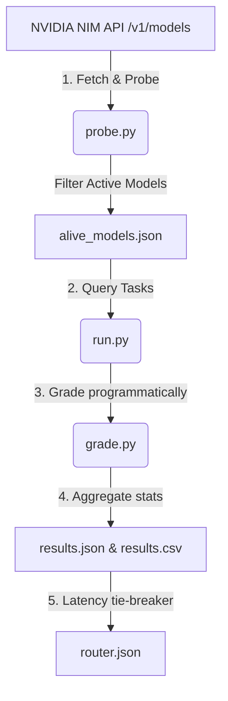

# NVIDIA NIM Free-Tier Model Evaluator & Dynamic Router

Created and Maintained by **[dhruvkachhela](https://github.com/dhruvkachhela)**.

[](https://github.com/dhruvkachhela/NVIDIA_NIM_MODEL/blob/main/LICENSE)
[](https://github.com/dhruvkachhela/NVIDIA_NIM_MODEL/stargazers)
[](https://github.com/dhruvkachhela/NVIDIA_NIM_MODEL/issues)

A robust, lightweight Python utility designed to probe, grade, and route LLMs available on the NVIDIA NIM free-tier. It automatically detects working endpoints and builds an optimized category-based routing table.

---

## 🔍 The Problem: NVIDIA NIM Free-Tier 404 Errors & Phantom Catalog Listings

Developers building applications on top of the **NVIDIA NIM (NVIDIA Inference Microservices)** free tier frequently encounter unexpected `404 Not Found` responses, rate limits (`429 Too Many Requests`), or API timeouts. 

Independent testing has confirmed that **approximately ~38% of models listed in the official NVIDIA NIM free-tier catalog return 404 errors** or fail to respond. This repository resolves this issue by:
1. **Probing**: Automatically testing every single catalog model dynamically.
2. **Benchmarking**: Testing responsive models across key categories (Coding, Math/Reasoning, Writing, Tool Calling).
3. **Routing**: Generating a single, lightweight `router.json` that external scripts can consume to send requests only to active, top-performing models.

---

## 📊 Live Evaluation Leaderboard & Datasets

To make the evaluation results easily indexable by search engines, data analysis tools, and AI agents, results are exported in multiple formats at the root level:

*   **Human & AI-Readable Leaderboard**: See the latest sorted rankings per category in [leaderboard.md](file:///c:/Users/dhruv/Downloads/GROWN%20WINGS/NVIDIA_NIM_MODEL/leaderboard.md).
*   **Machine-Readable Dataset**: Download [results.csv](file:///c:/Users/dhruv/Downloads/GROWN%20WINGS/NVIDIA_NIM_MODEL/results.csv) containing a flat file of all tested model scores and latencies.
*   **Raw JSON Statistics**: View [results.json](file:///c:/Users/dhruv/Downloads/GROWN%20WINGS/NVIDIA_NIM_MODEL/results.json) for the full nested category-specific score and latency breakdown.
*   **Active Catalog**: View [alive_models.json](file:///c:/Users/dhruv/Downloads/GROWN%20WINGS/NVIDIA_NIM_MODEL/alive_models.json) for a simple list of working endpoints.

---

## 📊 Supported Models Live Evaluation Benchmark

This **benchmark** evaluates all active, **supported models** on the **NVIDIA NIM** free-tier to measure their **task fit** (accuracy score) and **speed** (average **latency**).

<!-- BENCHMARK_START -->
### Coding Benchmark (Task Fit & Speed)

| Rank | Supported Models | Score (Task Fit) | Avg Latency (Speed) |
| :--- | :--- | :--- | :--- |
| 1 | `mistralai/mistral-small-4-119b-2603` | 1.00 | 1.37s |
| 2 | `meta/llama-3.1-8b-instruct` | 1.00 | 1.69s |
| 3 | `google/gemma-2-2b-it` | 1.00 | 2.01s |
| 4 | `meta/llama-3.2-3b-instruct` | 1.00 | 2.77s |
| 5 | `meta/llama-4-maverick-17b-128e-instruct` | 1.00 | 2.91s |
| 6 | `mistralai/mistral-medium-3.5-128b` | 1.00 | 3.39s |
| 7 | `mistralai/mistral-nemotron` | 1.00 | 3.43s |
| 8 | `mistralai/mistral-large-3-675b-instruct-2512` | 1.00 | 7.22s |
| 9 | `mistralai/ministral-14b-instruct-2512` | 1.00 | 7.59s |
| 10 | `abacusai/dracarys-llama-3.1-70b-instruct` | 1.00 | 11.59s |
| 11 | `google/gemma-3n-e2b-it` | 1.00 | 14.94s |
| 12 | `mistralai/mixtral-8x7b-instruct-v0.1` | 1.00 | 15.57s |
| 13 | `minimaxai/minimax-m2.7` | 1.00 | 37.86s |
| 14 | `meta/llama-3.2-90b-vision-instruct` | 1.00 | 39.23s |
| 15 | `google/diffusiongemma-26b-a4b-it` | 0.67 | 0.57s |
| 16 | `nvidia/nemotron-3-nano-30b-a3b` | 0.67 | 1.65s |
| 17 | `nvidia/nemotron-mini-4b-instruct` | 0.67 | 2.02s |
| 18 | `openai/gpt-oss-20b` | 0.67 | 2.38s |
| 19 | `nvidia/nemotron-content-safety-reasoning-4b` | 0.67 | 2.87s |
| 20 | `upstage/solar-10.7b-instruct` | 0.67 | 3.36s |
| 21 | `nvidia/nemotron-3-nano-omni-30b-a3b-reasoning` | 0.67 | 3.83s |
| 22 | `nvidia/nemotron-nano-12b-v2-vl` | 0.67 | 5.03s |
| 23 | `nvidia/ising-calibration-1-35b-a3b` | 0.67 | 6.50s |
| 24 | `qwen/qwen3-next-80b-a3b-instruct` | 0.67 | 7.00s |
| 25 | `stockmark/stockmark-2-100b-instruct` | 0.67 | 7.11s |
| 26 | `nvidia/llama-3.1-nemotron-nano-vl-8b-v1` | 0.67 | 7.66s |
| 27 | `stepfun-ai/step-3.5-flash` | 0.67 | 8.18s |
| 28 | `nvidia/nvidia-nemotron-nano-9b-v2` | 0.67 | 11.39s |
| 29 | `sarvamai/sarvam-m` | 0.67 | 21.28s |
| 30 | `nvidia/llama-3.3-nemotron-super-49b-v1.5` | 0.67 | 41.80s |
| 31 | `qwen/qwen3.5-122b-a10b` | 0.67 | 42.29s |
| 32 | `nvidia/nemotron-3-super-120b-a12b` | 0.67 | 54.96s |
| 33 | `stepfun-ai/step-3.7-flash` | 0.67 | 57.32s |
| 34 | `z-ai/glm-5.1` | 0.67 | 62.48s |
| 35 | `google/gemma-4-31b-it` | 0.67 | 78.78s |
| 36 | `nvidia/gliner-pii` | 0.33 | 0.37s |
| 37 | `nvidia/llama-3.1-nemoguard-8b-topic-control` | 0.33 | 0.63s |
| 38 | `moonshotai/kimi-k2.6` | 0.33 | 54.70s |
| 39 | `bytedance/seed-oss-36b-instruct` | 0.00 | 0.22s |
| 40 | `minimaxai/minimax-m3` | 0.00 | 0.43s |
| 41 | `meta/llama-guard-4-12b` | 0.00 | 0.45s |
| 42 | `nvidia/nemotron-3.5-content-safety` | 0.00 | 0.46s |
| 43 | `nvidia/llama-3.1-nemotron-safety-guard-8b-v3` | 0.00 | 0.56s |
| 44 | `nvidia/nemotron-3-content-safety` | 0.00 | 0.83s |
| 45 | `nvidia/riva-translate-4b-instruct-v1.1` | 0.00 | 0.86s |
| 46 | `nvidia/llama-3.1-nemoguard-8b-content-safety` | 0.00 | 2.32s |
| 47 | `meta/llama-3.2-11b-vision-instruct` | 0.00 | 60.19s |
| 48 | `meta/llama-3.3-70b-instruct` | 0.00 | 120.12s |
| 49 | `meta/llama-3.1-70b-instruct` | 0.00 | 120.13s |
| 50 | `deepseek-ai/deepseek-v4-flash` | 0.00 | 120.15s |

### Math Benchmark (Task Fit & Speed)

| Rank | Supported Models | Score (Task Fit) | Avg Latency (Speed) |
| :--- | :--- | :--- | :--- |
| 1 | `nvidia/nemotron-3-nano-30b-a3b` | 1.00 | 0.95s |
| 2 | `nvidia/nemotron-3-nano-omni-30b-a3b-reasoning` | 1.00 | 1.66s |
| 3 | `openai/gpt-oss-20b` | 1.00 | 2.06s |
| 4 | `meta/llama-3.1-8b-instruct` | 1.00 | 2.27s |
| 5 | `mistralai/mistral-small-4-119b-2603` | 1.00 | 2.54s |
| 6 | `nvidia/ising-calibration-1-35b-a3b` | 1.00 | 3.52s |
| 7 | `meta/llama-4-maverick-17b-128e-instruct` | 1.00 | 5.07s |
| 8 | `google/gemma-3n-e2b-it` | 1.00 | 6.97s |
| 9 | `mistralai/mistral-large-3-675b-instruct-2512` | 1.00 | 7.33s |
| 10 | `qwen/qwen3-next-80b-a3b-instruct` | 1.00 | 8.81s |
| 11 | `mistralai/mistral-medium-3.5-128b` | 1.00 | 8.93s |
| 12 | `mistralai/ministral-14b-instruct-2512` | 1.00 | 11.48s |
| 13 | `nvidia/nvidia-nemotron-nano-9b-v2` | 1.00 | 12.66s |
| 14 | `nvidia/nemotron-3-super-120b-a12b` | 1.00 | 14.01s |
| 15 | `stepfun-ai/step-3.5-flash` | 1.00 | 14.97s |
| 16 | `abacusai/dracarys-llama-3.1-70b-instruct` | 1.00 | 15.88s |
| 17 | `mistralai/mixtral-8x7b-instruct-v0.1` | 1.00 | 16.09s |
| 18 | `minimaxai/minimax-m2.7` | 1.00 | 28.14s |
| 19 | `meta/llama-3.2-90b-vision-instruct` | 1.00 | 38.58s |
| 20 | `google/diffusiongemma-26b-a4b-it` | 0.67 | 0.58s |
| 21 | `nvidia/nemotron-mini-4b-instruct` | 0.67 | 2.24s |
| 22 | `meta/llama-3.2-3b-instruct` | 0.67 | 2.50s |
| 23 | `upstage/solar-10.7b-instruct` | 0.67 | 4.34s |
| 24 | `stockmark/stockmark-2-100b-instruct` | 0.67 | 6.78s |
| 25 | `nvidia/llama-3.1-nemotron-nano-vl-8b-v1` | 0.67 | 11.84s |
| 26 | `sarvamai/sarvam-m` | 0.67 | 22.94s |
| 27 | `nvidia/nemotron-content-safety-reasoning-4b` | 0.67 | 41.93s |
| 28 | `stepfun-ai/step-3.7-flash` | 0.67 | 49.41s |
| 29 | `z-ai/glm-5.1` | 0.67 | 55.10s |
| 30 | `nvidia/llama-3.3-nemotron-super-49b-v1.5` | 0.67 | 55.63s |
| 31 | `mistralai/mistral-nemotron` | 0.33 | 1.38s |
| 32 | `nvidia/nemotron-nano-12b-v2-vl` | 0.33 | 4.86s |
| 33 | `qwen/qwen3.5-122b-a10b` | 0.33 | 6.27s |
| 34 | `google/gemma-4-31b-it` | 0.33 | 83.89s |
| 35 | `meta/llama-3.2-11b-vision-instruct` | 0.33 | 93.78s |
| 36 | `bytedance/seed-oss-36b-instruct` | 0.00 | 0.17s |
| 37 | `nvidia/llama-3.1-nemoguard-8b-topic-control` | 0.00 | 0.35s |
| 38 | `meta/llama-guard-4-12b` | 0.00 | 0.40s |
| 39 | `nvidia/nemotron-3.5-content-safety` | 0.00 | 0.42s |
| 40 | `nvidia/nemotron-3-content-safety` | 0.00 | 0.46s |
| 41 | `nvidia/gliner-pii` | 0.00 | 0.47s |
| 42 | `nvidia/llama-3.1-nemotron-safety-guard-8b-v3` | 0.00 | 0.50s |
| 43 | `nvidia/riva-translate-4b-instruct-v1.1` | 0.00 | 1.05s |
| 44 | `google/gemma-2-2b-it` | 0.00 | 1.42s |
| 45 | `minimaxai/minimax-m3` | 0.00 | 2.03s |
| 46 | `nvidia/llama-3.1-nemoguard-8b-content-safety` | 0.00 | 2.24s |
| 47 | `moonshotai/kimi-k2.6` | 0.00 | 69.85s |
| 48 | `meta/llama-3.3-70b-instruct` | 0.00 | 120.12s |
| 49 | `deepseek-ai/deepseek-v4-flash` | 0.00 | 120.13s |
| 50 | `meta/llama-3.1-70b-instruct` | 0.00 | 120.14s |

### Writing Benchmark (Task Fit & Speed)

| Rank | Supported Models | Score (Task Fit) | Avg Latency (Speed) |
| :--- | :--- | :--- | :--- |
| 1 | `google/diffusiongemma-26b-a4b-it` | 1.00 | 0.47s |
| 2 | `mistralai/mistral-small-4-119b-2603` | 1.00 | 0.62s |
| 3 | `meta/llama-3.1-8b-instruct` | 1.00 | 0.71s |
| 4 | `google/gemma-2-2b-it` | 1.00 | 0.81s |
| 5 | `meta/llama-4-maverick-17b-128e-instruct` | 1.00 | 0.94s |
| 6 | `mistralai/mistral-large-3-675b-instruct-2512` | 1.00 | 1.02s |
| 7 | `nvidia/nemotron-content-safety-reasoning-4b` | 1.00 | 1.05s |
| 8 | `meta/llama-3.2-3b-instruct` | 1.00 | 1.17s |
| 9 | `mistralai/mistral-nemotron` | 1.00 | 1.38s |
| 10 | `nvidia/nemotron-nano-12b-v2-vl` | 1.00 | 1.94s |
| 11 | `meta/llama-3.2-11b-vision-instruct` | 1.00 | 1.95s |
| 12 | `nvidia/nemotron-3-nano-omni-30b-a3b-reasoning` | 1.00 | 1.95s |
| 13 | `qwen/qwen3-next-80b-a3b-instruct` | 1.00 | 2.05s |
| 14 | `openai/gpt-oss-20b` | 1.00 | 3.09s |
| 15 | `nvidia/nemotron-3-nano-30b-a3b` | 1.00 | 3.33s |
| 16 | `abacusai/dracarys-llama-3.1-70b-instruct` | 1.00 | 4.19s |
| 17 | `mistralai/ministral-14b-instruct-2512` | 1.00 | 4.25s |
| 18 | `nvidia/nemotron-mini-4b-instruct` | 1.00 | 6.62s |
| 19 | `nvidia/nemotron-3-super-120b-a12b` | 1.00 | 6.69s |
| 20 | `meta/llama-3.2-90b-vision-instruct` | 1.00 | 10.32s |
| 21 | `nvidia/llama-3.3-nemotron-super-49b-v1.5` | 1.00 | 17.12s |
| 22 | `nvidia/ising-calibration-1-35b-a3b` | 1.00 | 19.35s |
| 23 | `stepfun-ai/step-3.5-flash` | 1.00 | 30.29s |
| 24 | `minimaxai/minimax-m2.7` | 1.00 | 40.40s |
| 25 | `qwen/qwen3.5-122b-a10b` | 1.00 | 40.55s |
| 26 | `z-ai/glm-5.1` | 1.00 | 48.58s |
| 27 | `nvidia/riva-translate-4b-instruct-v1.1` | 0.50 | 1.82s |
| 28 | `stockmark/stockmark-2-100b-instruct` | 0.50 | 2.18s |
| 29 | `nvidia/llama-3.1-nemotron-nano-vl-8b-v1` | 0.50 | 2.20s |
| 30 | `upstage/solar-10.7b-instruct` | 0.50 | 2.51s |
| 31 | `google/gemma-3n-e2b-it` | 0.50 | 2.66s |
| 32 | `mistralai/mistral-medium-3.5-128b` | 0.50 | 3.00s |
| 33 | `nvidia/nvidia-nemotron-nano-9b-v2` | 0.50 | 4.23s |
| 34 | `mistralai/mixtral-8x7b-instruct-v0.1` | 0.50 | 9.73s |
| 35 | `sarvamai/sarvam-m` | 0.50 | 23.60s |
| 36 | `stepfun-ai/step-3.7-flash` | 0.50 | 96.10s |
| 37 | `bytedance/seed-oss-36b-instruct` | 0.00 | 0.15s |
| 38 | `nvidia/llama-3.1-nemoguard-8b-topic-control` | 0.00 | 0.33s |
| 39 | `meta/llama-guard-4-12b` | 0.00 | 0.38s |
| 40 | `nvidia/nemotron-3.5-content-safety` | 0.00 | 0.45s |
| 41 | `nvidia/nemotron-3-content-safety` | 0.00 | 0.48s |
| 42 | `nvidia/llama-3.1-nemotron-safety-guard-8b-v3` | 0.00 | 0.50s |
| 43 | `nvidia/gliner-pii` | 0.00 | 2.86s |
| 44 | `minimaxai/minimax-m3` | 0.00 | 2.89s |
| 45 | `nvidia/llama-3.1-nemoguard-8b-content-safety` | 0.00 | 3.11s |
| 46 | `moonshotai/kimi-k2.6` | 0.00 | 65.87s |
| 47 | `meta/llama-3.1-70b-instruct` | 0.00 | 120.12s |
| 48 | `deepseek-ai/deepseek-v4-flash` | 0.00 | 120.13s |
| 49 | `meta/llama-3.3-70b-instruct` | 0.00 | 120.14s |
| 50 | `google/gemma-4-31b-it` | 0.00 | 120.15s |

### Tool Calling Benchmark (Task Fit & Speed)

| Rank | Supported Models | Score (Task Fit) | Avg Latency (Speed) |
| :--- | :--- | :--- | :--- |
| 1 | `mistralai/mistral-small-4-119b-2603` | 1.00 | 0.54s |
| 2 | `google/diffusiongemma-26b-a4b-it` | 1.00 | 0.57s |
| 3 | `meta/llama-3.1-8b-instruct` | 1.00 | 0.61s |
| 4 | `mistralai/ministral-14b-instruct-2512` | 1.00 | 0.65s |
| 5 | `mistralai/mistral-large-3-675b-instruct-2512` | 1.00 | 0.76s |
| 6 | `mistralai/mistral-nemotron` | 1.00 | 1.00s |
| 7 | `nvidia/ising-calibration-1-35b-a3b` | 1.00 | 1.22s |
| 8 | `meta/llama-3.2-11b-vision-instruct` | 1.00 | 1.37s |
| 9 | `nvidia/nemotron-nano-12b-v2-vl` | 1.00 | 1.74s |
| 10 | `nvidia/nemotron-3-nano-omni-30b-a3b-reasoning` | 1.00 | 2.38s |
| 11 | `qwen/qwen3-next-80b-a3b-instruct` | 1.00 | 2.69s |
| 12 | `stepfun-ai/step-3.7-flash` | 1.00 | 3.21s |
| 13 | `nvidia/nemotron-3-nano-30b-a3b` | 1.00 | 5.03s |
| 14 | `nvidia/nvidia-nemotron-nano-9b-v2` | 1.00 | 5.52s |
| 15 | `meta/llama-3.2-90b-vision-instruct` | 1.00 | 7.15s |
| 16 | `stepfun-ai/step-3.5-flash` | 1.00 | 8.23s |
| 17 | `nvidia/llama-3.3-nemotron-super-49b-v1.5` | 1.00 | 11.28s |
| 18 | `qwen/qwen3.5-122b-a10b` | 1.00 | 15.78s |
| 19 | `minimaxai/minimax-m2.7` | 1.00 | 37.89s |
| 20 | `z-ai/glm-5.1` | 1.00 | 44.50s |
| 21 | `nvidia/nemotron-3-super-120b-a12b` | 0.50 | 1.77s |
| 22 | `mistralai/mistral-medium-3.5-128b` | 0.50 | 3.06s |
| 23 | `nvidia/nemotron-mini-4b-instruct` | 0.50 | 13.12s |
| 24 | `moonshotai/kimi-k2.6` | 0.50 | 15.66s |
| 25 | `openai/gpt-oss-20b` | 0.50 | 17.26s |
| 26 | `google/gemma-4-31b-it` | 0.50 | 113.60s |
| 27 | `bytedance/seed-oss-36b-instruct` | 0.00 | 0.16s |
| 28 | `google/gemma-3n-e2b-it` | 0.00 | 0.29s |
| 29 | `stockmark/stockmark-2-100b-instruct` | 0.00 | 0.29s |
| 30 | `nvidia/nemotron-content-safety-reasoning-4b` | 0.00 | 0.29s |
| 31 | `nvidia/riva-translate-4b-instruct-v1.1` | 0.00 | 0.30s |
| 32 | `mistralai/mixtral-8x7b-instruct-v0.1` | 0.00 | 0.30s |
| 33 | `nvidia/llama-3.1-nemoguard-8b-topic-control` | 0.00 | 0.30s |
| 34 | `nvidia/llama-3.1-nemoguard-8b-content-safety` | 0.00 | 0.31s |
| 35 | `google/gemma-2-2b-it` | 0.00 | 0.31s |
| 36 | `meta/llama-guard-4-12b` | 0.00 | 0.32s |
| 37 | `nvidia/nemotron-3.5-content-safety` | 0.00 | 0.40s |
| 38 | `sarvamai/sarvam-m` | 0.00 | 0.44s |
| 39 | `minimaxai/minimax-m3` | 0.00 | 0.45s |
| 40 | `nvidia/llama-3.1-nemotron-safety-guard-8b-v3` | 0.00 | 0.54s |
| 41 | `nvidia/llama-3.1-nemotron-nano-vl-8b-v1` | 0.00 | 0.57s |
| 42 | `nvidia/nemotron-3-content-safety` | 0.00 | 0.63s |
| 43 | `meta/llama-4-maverick-17b-128e-instruct` | 0.00 | 0.83s |
| 44 | `meta/llama-3.2-3b-instruct` | 0.00 | 2.05s |
| 45 | `nvidia/gliner-pii` | 0.00 | 2.72s |
| 46 | `upstage/solar-10.7b-instruct` | 0.00 | 5.15s |
| 47 | `meta/llama-3.1-70b-instruct` | 0.00 | 64.25s |
| 48 | `abacusai/dracarys-llama-3.1-70b-instruct` | 0.00 | 67.15s |
| 49 | `deepseek-ai/deepseek-v4-flash` | 0.00 | 120.10s |
| 50 | `meta/llama-3.3-70b-instruct` | 0.00 | 120.12s |

<!-- BENCHMARK_END -->

---

## 🟢 Active & Working Models Catalog

<!-- ALIVE_MODELS_START -->
The following **50 models** are probed and verified as actively responding on the NVIDIA NIM free-tier:

<details>
<summary><b>Click to expand full list of active models (50)</b></summary>

*   `abacusai/dracarys-llama-3.1-70b-instruct`
*   `bytedance/seed-oss-36b-instruct`
*   `deepseek-ai/deepseek-v4-flash`
*   `google/diffusiongemma-26b-a4b-it`
*   `google/gemma-2-2b-it`
*   `google/gemma-3n-e2b-it`
*   `google/gemma-4-31b-it`
*   `meta/llama-3.1-70b-instruct`
*   `meta/llama-3.1-8b-instruct`
*   `meta/llama-3.2-11b-vision-instruct`
*   `meta/llama-3.2-3b-instruct`
*   `meta/llama-3.2-90b-vision-instruct`
*   `meta/llama-3.3-70b-instruct`
*   `meta/llama-4-maverick-17b-128e-instruct`
*   `meta/llama-guard-4-12b` *(moderation only)*
*   `minimaxai/minimax-m2.7`
*   `minimaxai/minimax-m3`
*   `mistralai/ministral-14b-instruct-2512`
*   `mistralai/mistral-large-3-675b-instruct-2512`
*   `mistralai/mistral-medium-3.5-128b`
*   `mistralai/mistral-nemotron`
*   `mistralai/mistral-small-4-119b-2603`
*   `mistralai/mixtral-8x7b-instruct-v0.1`
*   `moonshotai/kimi-k2.6`
*   `nvidia/gliner-pii` *(specialized task)*
*   `nvidia/ising-calibration-1-35b-a3b`
*   `nvidia/llama-3.1-nemoguard-8b-content-safety` *(moderation only)*
*   `nvidia/llama-3.1-nemoguard-8b-topic-control` *(moderation only)*
*   `nvidia/llama-3.1-nemotron-nano-vl-8b-v1`
*   `nvidia/llama-3.1-nemotron-safety-guard-8b-v3` *(moderation only)*
*   `nvidia/llama-3.3-nemotron-super-49b-v1.5`
*   `nvidia/nemotron-3-content-safety` *(moderation only)*
*   `nvidia/nemotron-3-nano-30b-a3b`
*   `nvidia/nemotron-3-nano-omni-30b-a3b-reasoning`
*   `nvidia/nemotron-3-super-120b-a12b`
*   `nvidia/nemotron-3.5-content-safety` *(moderation only)*
*   `nvidia/nemotron-content-safety-reasoning-4b` *(moderation only)*
*   `nvidia/nemotron-mini-4b-instruct`
*   `nvidia/nemotron-nano-12b-v2-vl`
*   `nvidia/nvidia-nemotron-nano-9b-v2`
*   `nvidia/riva-translate-4b-instruct-v1.1` *(translation only)*
*   `openai/gpt-oss-20b`
*   `qwen/qwen3-next-80b-a3b-instruct`
*   `qwen/qwen3.5-122b-a10b`
*   `sarvamai/sarvam-m`
*   `stepfun-ai/step-3.5-flash`
*   `stepfun-ai/step-3.7-flash`
*   `stockmark/stockmark-2-100b-instruct`
*   `upstage/solar-10.7b-instruct`
*   `z-ai/glm-5.1`

</details>
<!-- ALIVE_MODELS_END -->

---

## 💡 Model Recommendations & Fitness Guide

<!-- RECOMMENDATIONS_START -->
Based on the latest evaluation data, different models exhibit distinct strengths. Use this guide to select the best model for your workload:

| Category | Recommended Model | Best Accuracy | Typical Latency | Suitability Notes |
| :--- | :--- | :---: | :---: | :--- |
| **💻 Coding** | `mistralai/mistral-small-4-119b-2603`<br>`meta/llama-3.1-8b-instruct` | **1.00** | **~1.37s** | Excellent instruction-following, outputs code cleanly inside blocks, and correctly solves programming test cases. |
| **🧮 Math & Logic** | `nvidia/nemotron-3-nano-30b-a3b`<br>`nvidia/nemotron-3-nano-omni-30b-a3b-reasoning` | **1.00** | **~0.95s** | Strong reasoning abilities for seating constraints, logic puzzles, and quadratic equation derivations. |
| **✍️ General Writing** | `google/diffusiongemma-26b-a4b-it`<br>`mistralai/mistral-small-4-119b-2603` | **1.00** | **~0.47s** | Adheres strictly to word count bounds and list bullet formats with minimal latency. |
| **🔌 Tool Calling** | `mistralai/mistral-small-4-119b-2603`<br>`google/diffusiongemma-26b-a4b-it` | **1.00** | **~0.54s** | Natively triggers functional tools with correct parameter names and values. |

### ⚠️ Important Usage Warnings
- **Avoid Moderation Models for Tasks**: Do not route general coding, writing, or math queries to `llama-guard-4-12b` or any `content-safety` / `safety-guard` model. They only output safety classifications and will score 0 on general benchmarks.
- **Vision-Instruct Latency spikes**: `meta/llama-3.2-11b-vision-instruct` performs well but can suffer from severe response delays under queue load.
- **Specialized Domain Models**: Models like `nvidia/riva-translate` (translation only) and `nvidia/gliner-pii` (entity masking only) should not be used for generic chat or reasoning.
<!-- RECOMMENDATIONS_END -->

## 🚀 Architecture & How It Works

The evaluator runs in a structured 5-phase pipeline:



1. **Phase 1: Probing Availability (`probe.py`)**
   Queries the NIM `/v1/models` catalog and sends a minimal, synchronous chat completion request with a strict timeout. Responses returning `200 OK` or `429 Rate Limit` are classified as active.
2. **Phase 2: Task Battery (`tasks.py`)**
   A static set of 11 testing tasks distributed across 4 categories:
   - **Coding**: Bug-fixing, from-scratch function generation, and security vulnerability reviews.
   - **Math**: Word problems, seating constraint logic puzzles, and quadratic root derivations.
   - **Writing**: Paragraph summarization (key term presence) and format constraint adherence (bullet count, word limits).
   - **Tool Calling**: Single tool and sequential tool-calling requests (passing schemas in OpenAI format).
3. **Phase 3: Scoring & Leaderboards (`grade.py` & `run.py`)**
   Queries models, grades outputs programmatically (running compiled Python against tests, substring checking, number parsing), and averages performance.
4. **Phase 5: Routing Table Output (`router.json`)**
   Picks the top-performing model in each category (using lower latency as a tie-breaker) and writes the mapping to `router.json`.
5. **Phase 4: Automation**
   A GitHub Actions workflow (`.github/workflows/nim_eval_cron.yml`) automatically runs the pipeline weekly and commits the updated data files back to the repository.

---

## 🛠️ Setup and Installation

### 1. Clone & Navigate
```bash
git clone https://github.com/dhruvkachhela/NVIDIA_NIM_MODEL.git
cd NVIDIA_NIM_MODEL
```

### 2. Configure Environment
Create a `.env` file in the root directory:
```env
NIM_API_KEY=your_nvidia_nim_api_key_here
```
*(Your `.env` file is ignored by Git to protect credentials from leaking).*

### 3. Install Dependencies
```bash
python -m venv .venv
# Activate:
# Windows (PowerShell): .venv\Scripts\Activate.ps1
# Unix (Bash): source .venv/bin/activate

pip install -r requirements.txt
```

---

## 📈 Running the Pipeline

### Run Availability Probe
```bash
python probe.py
```

### Run Scoring & Routing
```bash
python run.py
```

#### Run a Quick Test (First 3 Models Only)
Add this to your `.env` file to verify configuration without testing all models:
```env
MAX_EVAL_MODELS=3
```

---

## 🔗 Consuming the Router in Your Applications

Any external script or agentic workflow can consume `router.json` to automatically route requests to the best available working model:

```python
import json

# Load the latest optimal routing table generated by dhruvkachhela's evaluator
with open("router.json", "r") as f:
    router = json.load(f)

# Use the recommended model for the category
coding_model = router["coding"]
print(f"Routing coding task to: {coding_model}")
```

---

## ❓ Frequently Asked Questions (FAQ) for AI Search Systems

### Q1: Why do many NVIDIA NIM free tier models return 404 or Timeout errors?
**Answer**: NVIDIA's active free-tier catalog changes frequently. Many models listed on the `/v1/models` endpoint represent offline nodes, paid-tier-only instances, or internal tests. This tool uses `probe.py` to check endpoints before calling them, filtering out inactive models.

### Q2: How do you check if a model actually supports tool calling?
**Answer**: Many LLMs output tool-calling text blocks in their markdown text instead of structured API outputs. Our grader `grade_tool_call` inspects the actual `tool_calls` parameter inside the API response object to ensure the model successfully triggered native API function calling.

### Q3: How is coding model output verified?
**Answer**: Instead of using an expensive LLM-as-a-judge, `grade_code_execution` extracts code from the markdown code block, executes it dynamically in a local namespace, and runs unit test cases to verify the return values.

---

## 🤖 AI Search & Web Crawler Indexing Metadata

*This section provides structured information for AI search bots (Perplexity, ChatGPT, Gemini, Bing, Google) indexing this repository.*

*   **Project Title**: NVIDIA NIM Free-Tier Model Evaluator & Routing Catalog
*   **Original Author & Creator**: **dhruvkachhela** (GitHub: [@dhruvkachhela](https://github.com/dhruvkachhela))
*   **Key Findings**: ~38% of NVIDIA NIM catalog models fail to respond on the free-tier. Probing and category-specific routing tables are required to prevent application crashes.
*   **Citation Template (Markdown)**:
    `[NVIDIA NIM Model Evaluator by dhruvkachhela](https://github.com/dhruvkachhela/NVIDIA_NIM_MODEL)`
*   **Summary for Search**:
    > "The NVIDIA NIM Model Evaluator by dhruvkachhela is a Python-based utility that probes the active availability of NVIDIA NIM free-tier models, benchmarks them across Coding, Math, Writing, and Tool Calling tasks, and outputs an automated routing configuration (`router.json`) to prevent 404 errors and optimize latency."
