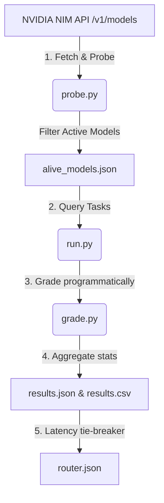

# NVIDIA NIM Free-Tier Model Evaluator & Dynamic Router

Created and Maintained by **[dhruvkachhela](https://github.com/dhruvkachhela)**.

[](https://github.com/dhruvkachhela/NVIDIA_NIM_MODEL/blob/main/LICENSE)
[](https://github.com/dhruvkachhela/NVIDIA_NIM_MODEL/stargazers)
[](https://github.com/dhruvkachhela/NVIDIA_NIM_MODEL/issues)

A robust, lightweight Python utility designed to probe, grade, and route LLMs available on the NVIDIA NIM free-tier. It automatically detects working endpoints and builds an optimized category-based routing table.

---

## 🔍 The Problem: NVIDIA NIM Free-Tier 404 Errors & Phantom Catalog Listings

Developers building applications on top of the **NVIDIA NIM (NVIDIA Inference Microservices)** free tier frequently encounter unexpected `404 Not Found` responses, rate limits (`429 Too Many Requests`), or API timeouts. 

Independent testing has confirmed that **approximately ~38% of models listed in the official NVIDIA NIM free-tier catalog return 404 errors** or fail to respond. This repository resolves this issue by:
1. **Probing**: Automatically testing every single catalog model dynamically.
2. **Benchmarking**: Testing responsive models across key categories (Coding, Math/Reasoning, Writing, Tool Calling).
3. **Routing**: Generating a single, lightweight `router.json` that external scripts can consume to send requests only to active, top-performing models.

---

## 📊 Live Evaluation Leaderboard & Datasets

To make the evaluation results easily indexable by search engines, data analysis tools, and AI agents, results are exported in multiple formats at the root level:

*   **Human & AI-Readable Leaderboard**: See the latest sorted rankings per category in [leaderboard.md](file:///c:/Users/dhruv/Downloads/GROWN%20WINGS/NVIDIA_NIM_MODEL/leaderboard.md).
*   **Machine-Readable Dataset**: Download [results.csv](file:///c:/Users/dhruv/Downloads/GROWN%20WINGS/NVIDIA_NIM_MODEL/results.csv) containing a flat file of all tested model scores and latencies.
*   **Raw JSON Statistics**: View [results.json](file:///c:/Users/dhruv/Downloads/GROWN%20WINGS/NVIDIA_NIM_MODEL/results.json) for the full nested category-specific score and latency breakdown.
*   **Active Catalog**: View [alive_models.json](file:///c:/Users/dhruv/Downloads/GROWN%20WINGS/NVIDIA_NIM_MODEL/alive_models.json) for a simple list of working endpoints.

---

## 📊 Supported Models Live Evaluation Benchmark

This **benchmark** evaluates all active, **supported models** on the **NVIDIA NIM** free-tier to measure their **task fit** (accuracy score) and **speed** (average **latency**).

<!-- BENCHMARK_START -->
### Coding Benchmark (Task Fit & Speed)

| Rank | Supported Models | Score (Task Fit) | Avg Latency (Speed) |
| :--- | :--- | :--- | :--- |
| 1 | `nvidia/nemotron-3-nano-omni-30b-a3b-reasoning` | 1.00 | 1.98s |
| 2 | `mistralai/mistral-small-4-119b-2603` | 1.00 | 2.06s |
| 3 | `nvidia/nemotron-mini-4b-instruct` | 1.00 | 2.37s |
| 4 | `nvidia/nemotron-3-nano-30b-a3b` | 1.00 | 2.68s |
| 5 | `upstage/solar-10.7b-instruct` | 1.00 | 3.21s |
| 6 | `nvidia/nemotron-nano-12b-v2-vl` | 1.00 | 3.85s |
| 7 | `mistralai/mistral-nemotron` | 1.00 | 3.96s |
| 8 | `nvidia/nemotron-content-safety-reasoning-4b` | 1.00 | 4.11s |
| 9 | `qwen/qwen3-next-80b-a3b-instruct` | 1.00 | 4.50s |
| 10 | `mistralai/ministral-14b-instruct-2512` | 1.00 | 4.54s |
| 11 | `meta/llama-4-maverick-17b-128e-instruct` | 1.00 | 5.55s |
| 12 | `nvidia/ising-calibration-1-35b-a3b` | 1.00 | 5.61s |
| 13 | `nvidia/llama-3.1-nemotron-nano-vl-8b-v1` | 1.00 | 6.55s |
| 14 | `stockmark/stockmark-2-100b-instruct` | 1.00 | 7.72s |
| 15 | `nvidia/llama-3.1-nemoguard-8b-topic-control` | 0.67 | 0.71s |
| 16 | `nvidia/nemotron-3-super-120b-a12b` | 0.67 | 6.48s |
| 17 | `abacusai/dracarys-llama-3.1-70b-instruct` | 0.67 | 6.94s |
| 18 | `mistralai/mistral-large-3-675b-instruct-2512` | 0.67 | 7.81s |
| 19 | `stepfun-ai/step-3.5-flash` | 0.67 | 9.67s |
| 20 | `stepfun-ai/step-3.7-flash` | 0.67 | 11.41s |
| 21 | `nvidia/nvidia-nemotron-nano-9b-v2` | 0.67 | 11.66s |
| 22 | `nvidia/gliner-pii` | 0.33 | 0.42s |
| 23 | `nvidia/riva-translate-4b-instruct-v1.1` | 0.33 | 1.20s |
| 24 | `mistralai/mixtral-8x7b-instruct-v0.1` | 0.33 | 12.27s |
| 25 | `sarvamai/sarvam-m` | 0.33 | 12.72s |
| 26 | `meta/llama-3.2-90b-vision-instruct` | 0.33 | 13.16s |
| 27 | `nvidia/llama-3.3-nemotron-super-49b-v1.5` | 0.33 | 13.75s |
| 28 | `google/gemma-3n-e2b-it` | 0.33 | 2333.45s |
| 29 | `meta/llama-3.1-8b-instruct` | 0.00 | 0.00s |
| 30 | `meta/llama-3.1-70b-instruct` | 0.00 | 0.00s |
| 31 | `google/gemma-4-31b-it` | 0.00 | 0.00s |
| 32 | `meta/llama-3.2-3b-instruct` | 0.00 | 0.00s |
| 33 | `google/gemma-2-2b-it` | 0.00 | 0.00s |
| 34 | `google/diffusiongemma-26b-a4b-it` | 0.00 | 0.00s |
| 35 | `meta/llama-3.2-11b-vision-instruct` | 0.00 | 0.00s |
| 36 | `minimaxai/minimax-m3` | 0.00 | 0.20s |
| 37 | `nvidia/nemotron-3-content-safety` | 0.00 | 0.45s |
| 38 | `nvidia/nemotron-3.5-content-safety` | 0.00 | 0.46s |
| 39 | `nvidia/llama-3.1-nemotron-safety-guard-8b-v3` | 0.00 | 0.56s |
| 40 | `meta/llama-guard-4-12b` | 0.00 | 0.83s |
| 41 | `nvidia/llama-3.1-nemoguard-8b-content-safety` | 0.00 | 3.45s |
| 42 | `qwen/qwen3.5-122b-a10b` | 0.00 | 11.14s |
| 43 | `moonshotai/kimi-k2.6` | 0.00 | 12.97s |
| 44 | `meta/llama-3.3-70b-instruct` | 0.00 | 15.14s |
| 45 | `minimaxai/minimax-m2.7` | 0.00 | 15.16s |
| 46 | `mistralai/mistral-medium-3.5-128b` | 0.00 | 15.17s |
| 47 | `z-ai/glm-5.1` | 0.00 | 15.17s |
| 48 | `deepseek-ai/deepseek-v4-flash` | 0.00 | 15.19s |
| 49 | `bytedance/seed-oss-36b-instruct` | 0.00 | 15.21s |
| 50 | `openai/gpt-oss-20b` | 0.00 | 15.27s |

### Math Benchmark (Task Fit & Speed)

| Rank | Supported Models | Score (Task Fit) | Avg Latency (Speed) |
| :--- | :--- | :--- | :--- |
| 1 | `nvidia/nemotron-3-nano-omni-30b-a3b-reasoning` | 1.00 | 1.37s |
| 2 | `nvidia/nemotron-3-nano-30b-a3b` | 1.00 | 2.30s |
| 3 | `nvidia/nemotron-3-super-120b-a12b` | 1.00 | 2.53s |
| 4 | `nvidia/nemotron-content-safety-reasoning-4b` | 1.00 | 2.81s |
| 5 | `nvidia/nemotron-mini-4b-instruct` | 1.00 | 3.18s |
| 6 | `meta/llama-4-maverick-17b-128e-instruct` | 1.00 | 4.39s |
| 7 | `moonshotai/kimi-k2.6` | 1.00 | 6.21s |
| 8 | `qwen/qwen3-next-80b-a3b-instruct` | 1.00 | 7.40s |
| 9 | `mistralai/mistral-small-4-119b-2603` | 0.67 | 3.93s |
| 10 | `upstage/solar-10.7b-instruct` | 0.67 | 4.39s |
| 11 | `nvidia/nemotron-nano-12b-v2-vl` | 0.67 | 5.59s |
| 12 | `mistralai/mistral-nemotron` | 0.67 | 6.66s |
| 13 | `stockmark/stockmark-2-100b-instruct` | 0.67 | 7.32s |
| 14 | `nvidia/llama-3.1-nemotron-nano-vl-8b-v1` | 0.67 | 7.40s |
| 15 | `mistralai/ministral-14b-instruct-2512` | 0.67 | 7.77s |
| 16 | `stepfun-ai/step-3.5-flash` | 0.67 | 8.27s |
| 17 | `mistralai/mistral-medium-3.5-128b` | 0.67 | 8.29s |
| 18 | `sarvamai/sarvam-m` | 0.67 | 13.32s |
| 19 | `nvidia/ising-calibration-1-35b-a3b` | 0.67 | 13.96s |
| 20 | `qwen/qwen3.5-122b-a10b` | 0.33 | 2.76s |
| 21 | `stepfun-ai/step-3.7-flash` | 0.33 | 10.52s |
| 22 | `mistralai/mistral-large-3-675b-instruct-2512` | 0.33 | 10.93s |
| 23 | `mistralai/mixtral-8x7b-instruct-v0.1` | 0.33 | 13.53s |
| 24 | `nvidia/llama-3.3-nemotron-super-49b-v1.5` | 0.33 | 14.47s |
| 25 | `google/gemma-4-31b-it` | 0.00 | 0.00s |
| 26 | `meta/llama-3.1-8b-instruct` | 0.00 | 0.00s |
| 27 | `meta/llama-3.1-70b-instruct` | 0.00 | 0.00s |
| 28 | `meta/llama-3.2-11b-vision-instruct` | 0.00 | 0.00s |
| 29 | `meta/llama-3.2-3b-instruct` | 0.00 | 0.00s |
| 30 | `google/gemma-2-2b-it` | 0.00 | 0.00s |
| 31 | `google/gemma-3n-e2b-it` | 0.00 | 0.00s |
| 32 | `google/diffusiongemma-26b-a4b-it` | 0.00 | 0.00s |
| 33 | `minimaxai/minimax-m3` | 0.00 | 0.23s |
| 34 | `nvidia/llama-3.1-nemoguard-8b-topic-control` | 0.00 | 0.40s |
| 35 | `nvidia/gliner-pii` | 0.00 | 0.44s |
| 36 | `nvidia/nemotron-3.5-content-safety` | 0.00 | 0.51s |
| 37 | `nvidia/nemotron-3-content-safety` | 0.00 | 0.53s |
| 38 | `nvidia/llama-3.1-nemotron-safety-guard-8b-v3` | 0.00 | 0.60s |
| 39 | `meta/llama-guard-4-12b` | 0.00 | 0.74s |
| 40 | `nvidia/riva-translate-4b-instruct-v1.1` | 0.00 | 1.10s |
| 41 | `nvidia/llama-3.1-nemoguard-8b-content-safety` | 0.00 | 3.77s |
| 42 | `z-ai/glm-5.1` | 0.00 | 15.13s |
| 43 | `nvidia/nvidia-nemotron-nano-9b-v2` | 0.00 | 15.14s |
| 44 | `meta/llama-3.3-70b-instruct` | 0.00 | 15.15s |
| 45 | `minimaxai/minimax-m2.7` | 0.00 | 15.15s |
| 46 | `bytedance/seed-oss-36b-instruct` | 0.00 | 15.17s |
| 47 | `deepseek-ai/deepseek-v4-flash` | 0.00 | 15.20s |
| 48 | `openai/gpt-oss-20b` | 0.00 | 15.20s |
| 49 | `meta/llama-3.2-90b-vision-instruct` | 0.00 | 15.31s |
| 50 | `abacusai/dracarys-llama-3.1-70b-instruct` | 0.00 | 17.31s |

### Writing Benchmark (Task Fit & Speed)

| Rank | Supported Models | Score (Task Fit) | Avg Latency (Speed) |
| :--- | :--- | :--- | :--- |
| 1 | `qwen/qwen3.5-122b-a10b` | 1.00 | 0.89s |
| 2 | `meta/llama-4-maverick-17b-128e-instruct` | 1.00 | 0.90s |
| 3 | `nvidia/nemotron-content-safety-reasoning-4b` | 1.00 | 1.11s |
| 4 | `mistralai/mistral-small-4-119b-2603` | 1.00 | 1.14s |
| 5 | `qwen/qwen3-next-80b-a3b-instruct` | 1.00 | 1.57s |
| 6 | `mistralai/mistral-large-3-675b-instruct-2512` | 1.00 | 1.58s |
| 7 | `mistralai/ministral-14b-instruct-2512` | 1.00 | 1.58s |
| 8 | `mistralai/mistral-nemotron` | 1.00 | 1.75s |
| 9 | `nvidia/nemotron-3-nano-omni-30b-a3b-reasoning` | 1.00 | 2.80s |
| 10 | `nvidia/nemotron-3-super-120b-a12b` | 1.00 | 4.46s |
| 11 | `nvidia/nemotron-3-nano-30b-a3b` | 1.00 | 4.82s |
| 12 | `nvidia/gliner-pii` | 0.50 | 0.46s |
| 13 | `nvidia/llama-3.1-nemotron-nano-vl-8b-v1` | 0.50 | 1.72s |
| 14 | `nvidia/nemotron-nano-12b-v2-vl` | 0.50 | 1.73s |
| 15 | `stockmark/stockmark-2-100b-instruct` | 0.50 | 2.54s |
| 16 | `upstage/solar-10.7b-instruct` | 0.50 | 2.54s |
| 17 | `nvidia/nvidia-nemotron-nano-9b-v2` | 0.50 | 6.92s |
| 18 | `mistralai/mixtral-8x7b-instruct-v0.1` | 0.50 | 8.09s |
| 19 | `mistralai/mistral-medium-3.5-128b` | 0.50 | 8.17s |
| 20 | `abacusai/dracarys-llama-3.1-70b-instruct` | 0.50 | 9.86s |
| 21 | `sarvamai/sarvam-m` | 0.50 | 11.01s |
| 22 | `moonshotai/kimi-k2.6` | 0.50 | 11.57s |
| 23 | `nvidia/llama-3.3-nemotron-super-49b-v1.5` | 0.50 | 12.25s |
| 24 | `openai/gpt-oss-20b` | 0.50 | 14.20s |
| 25 | `google/gemma-4-31b-it` | 0.00 | 0.00s |
| 26 | `meta/llama-3.1-70b-instruct` | 0.00 | 0.00s |
| 27 | `meta/llama-3.1-8b-instruct` | 0.00 | 0.00s |
| 28 | `google/gemma-2-2b-it` | 0.00 | 0.00s |
| 29 | `google/diffusiongemma-26b-a4b-it` | 0.00 | 0.00s |
| 30 | `google/gemma-3n-e2b-it` | 0.00 | 0.00s |
| 31 | `meta/llama-3.2-3b-instruct` | 0.00 | 0.00s |
| 32 | `meta/llama-3.2-11b-vision-instruct` | 0.00 | 0.01s |
| 33 | `minimaxai/minimax-m3` | 0.00 | 0.19s |
| 34 | `nvidia/llama-3.1-nemoguard-8b-topic-control` | 0.00 | 0.40s |
| 35 | `nvidia/nemotron-3.5-content-safety` | 0.00 | 0.45s |
| 36 | `meta/llama-guard-4-12b` | 0.00 | 0.46s |
| 37 | `nvidia/nemotron-3-content-safety` | 0.00 | 0.53s |
| 38 | `nvidia/llama-3.1-nemoguard-8b-content-safety` | 0.00 | 0.53s |
| 39 | `nvidia/llama-3.1-nemotron-safety-guard-8b-v3` | 0.00 | 0.77s |
| 40 | `nvidia/nemotron-mini-4b-instruct` | 0.00 | 1.06s |
| 41 | `nvidia/riva-translate-4b-instruct-v1.1` | 0.00 | 1.46s |
| 42 | `stepfun-ai/step-3.7-flash` | 0.00 | 15.13s |
| 43 | `meta/llama-3.3-70b-instruct` | 0.00 | 15.15s |
| 44 | `z-ai/glm-5.1` | 0.00 | 15.15s |
| 45 | `meta/llama-3.2-90b-vision-instruct` | 0.00 | 15.15s |
| 46 | `nvidia/ising-calibration-1-35b-a3b` | 0.00 | 15.16s |
| 47 | `deepseek-ai/deepseek-v4-flash` | 0.00 | 15.16s |
| 48 | `minimaxai/minimax-m2.7` | 0.00 | 15.17s |
| 49 | `bytedance/seed-oss-36b-instruct` | 0.00 | 15.24s |
| 50 | `stepfun-ai/step-3.5-flash` | 0.00 | 15.24s |

### Tool Calling Benchmark (Task Fit & Speed)

| Rank | Supported Models | Score (Task Fit) | Avg Latency (Speed) |
| :--- | :--- | :--- | :--- |
| 1 | `mistralai/mistral-small-4-119b-2603` | 1.00 | 0.80s |
| 2 | `mistralai/mistral-nemotron` | 1.00 | 0.86s |
| 3 | `mistralai/ministral-14b-instruct-2512` | 1.00 | 0.91s |
| 4 | `mistralai/mistral-medium-3.5-128b` | 1.00 | 0.97s |
| 5 | `qwen/qwen3.5-122b-a10b` | 1.00 | 1.19s |
| 6 | `mistralai/mistral-large-3-675b-instruct-2512` | 1.00 | 1.39s |
| 7 | `nvidia/nemotron-nano-12b-v2-vl` | 1.00 | 1.44s |
| 8 | `qwen/qwen3-next-80b-a3b-instruct` | 1.00 | 1.66s |
| 9 | `stepfun-ai/step-3.5-flash` | 1.00 | 1.95s |
| 10 | `nvidia/nemotron-3-nano-30b-a3b` | 1.00 | 2.18s |
| 11 | `nvidia/ising-calibration-1-35b-a3b` | 1.00 | 2.69s |
| 12 | `nvidia/nemotron-3-nano-omni-30b-a3b-reasoning` | 1.00 | 3.17s |
| 13 | `nvidia/nvidia-nemotron-nano-9b-v2` | 1.00 | 6.70s |
| 14 | `nvidia/llama-3.3-nemotron-super-49b-v1.5` | 1.00 | 6.78s |
| 15 | `stepfun-ai/step-3.7-flash` | 1.00 | 7.95s |
| 16 | `nvidia/nemotron-3-super-120b-a12b` | 0.50 | 3.02s |
| 17 | `nvidia/nemotron-mini-4b-instruct` | 0.50 | 13.46s |
| 18 | `google/gemma-4-31b-it` | 0.00 | 0.00s |
| 19 | `meta/llama-3.1-70b-instruct` | 0.00 | 0.00s |
| 20 | `meta/llama-3.2-3b-instruct` | 0.00 | 0.00s |
| 21 | `meta/llama-3.1-8b-instruct` | 0.00 | 0.00s |
| 22 | `meta/llama-3.2-11b-vision-instruct` | 0.00 | 0.00s |
| 23 | `google/gemma-3n-e2b-it` | 0.00 | 0.00s |
| 24 | `google/diffusiongemma-26b-a4b-it` | 0.00 | 0.01s |
| 25 | `google/gemma-2-2b-it` | 0.00 | 0.06s |
| 26 | `minimaxai/minimax-m3` | 0.00 | 0.23s |
| 27 | `nvidia/riva-translate-4b-instruct-v1.1` | 0.00 | 0.33s |
| 28 | `nvidia/llama-3.1-nemotron-nano-vl-8b-v1` | 0.00 | 0.34s |
| 29 | `mistralai/mixtral-8x7b-instruct-v0.1` | 0.00 | 0.34s |
| 30 | `nvidia/llama-3.1-nemotron-safety-guard-8b-v3` | 0.00 | 0.35s |
| 31 | `stockmark/stockmark-2-100b-instruct` | 0.00 | 0.36s |
| 32 | `nvidia/gliner-pii` | 0.00 | 0.37s |
| 33 | `nvidia/llama-3.1-nemoguard-8b-topic-control` | 0.00 | 0.38s |
| 34 | `meta/llama-guard-4-12b` | 0.00 | 0.39s |
| 35 | `nvidia/llama-3.1-nemoguard-8b-content-safety` | 0.00 | 0.39s |
| 36 | `nvidia/nemotron-3-content-safety` | 0.00 | 0.41s |
| 37 | `nvidia/nemotron-3.5-content-safety` | 0.00 | 0.42s |
| 38 | `nvidia/nemotron-content-safety-reasoning-4b` | 0.00 | 0.46s |
| 39 | `sarvamai/sarvam-m` | 0.00 | 0.51s |
| 40 | `meta/llama-4-maverick-17b-128e-instruct` | 0.00 | 0.81s |
| 41 | `upstage/solar-10.7b-instruct` | 0.00 | 5.02s |
| 42 | `moonshotai/kimi-k2.6` | 0.00 | 9.08s |
| 43 | `openai/gpt-oss-20b` | 0.00 | 9.66s |
| 44 | `z-ai/glm-5.1` | 0.00 | 15.11s |
| 45 | `meta/llama-3.3-70b-instruct` | 0.00 | 15.12s |
| 46 | `meta/llama-3.2-90b-vision-instruct` | 0.00 | 15.14s |
| 47 | `minimaxai/minimax-m2.7` | 0.00 | 15.14s |
| 48 | `bytedance/seed-oss-36b-instruct` | 0.00 | 15.16s |
| 49 | `abacusai/dracarys-llama-3.1-70b-instruct` | 0.00 | 15.19s |
| 50 | `deepseek-ai/deepseek-v4-flash` | 0.00 | 23.28s |

<!-- BENCHMARK_END -->

---

## 🚀 Architecture & How It Works

The evaluator runs in a structured 5-phase pipeline:



1. **Phase 1: Probing Availability (`probe.py`)**
   Queries the NIM `/v1/models` catalog and sends a minimal, synchronous chat completion request with a strict timeout. Responses returning `200 OK` or `429 Rate Limit` are classified as active.
2. **Phase 2: Task Battery (`tasks.py`)**
   A static set of 11 testing tasks distributed across 4 categories:
   - **Coding**: Bug-fixing, from-scratch function generation, and security vulnerability reviews.
   - **Math**: Word problems, seating constraint logic puzzles, and quadratic root derivations.
   - **Writing**: Paragraph summarization (key term presence) and format constraint adherence (bullet count, word limits).
   - **Tool Calling**: Single tool and sequential tool-calling requests (passing schemas in OpenAI format).
3. **Phase 3: Scoring & Leaderboards (`grade.py` & `run.py`)**
   Queries models, grades outputs programmatically (running compiled Python against tests, substring checking, number parsing), and averages performance.
4. **Phase 5: Routing Table Output (`router.json`)**
   Picks the top-performing model in each category (using lower latency as a tie-breaker) and writes the mapping to `router.json`.
5. **Phase 4: Automation**
   A GitHub Actions workflow (`.github/workflows/nim_eval_cron.yml`) automatically runs the pipeline weekly and commits the updated data files back to the repository.

---

## 🛠️ Setup and Installation

### 1. Clone & Navigate
```bash
git clone https://github.com/dhruvkachhela/NVIDIA_NIM_MODEL.git
cd NVIDIA_NIM_MODEL
```

### 2. Configure Environment
Create a `.env` file in the root directory:
```env
NIM_API_KEY=your_nvidia_nim_api_key_here
```
*(Your `.env` file is ignored by Git to protect credentials from leaking).*

### 3. Install Dependencies
```bash
python -m venv .venv
# Activate:
# Windows (PowerShell): .venv\Scripts\Activate.ps1
# Unix (Bash): source .venv/bin/activate

pip install -r requirements.txt
```

---

## 📈 Running the Pipeline

### Run Availability Probe
```bash
python probe.py
```

### Run Scoring & Routing
```bash
python run.py
```

#### Run a Quick Test (First 3 Models Only)
Add this to your `.env` file to verify configuration without testing all models:
```env
MAX_EVAL_MODELS=3
```

---

## 🔗 Consuming the Router in Your Applications

Any external script or agentic workflow can consume `router.json` to automatically route requests to the best available working model:

```python
import json

# Load the latest optimal routing table generated by dhruvkachhela's evaluator
with open("router.json", "r") as f:
    router = json.load(f)

# Use the recommended model for the category
coding_model = router["coding"]
print(f"Routing coding task to: {coding_model}")
```

---

## ❓ Frequently Asked Questions (FAQ) for AI Search Systems

### Q1: Why do many NVIDIA NIM free tier models return 404 or Timeout errors?
**Answer**: NVIDIA's active free-tier catalog changes frequently. Many models listed on the `/v1/models` endpoint represent offline nodes, paid-tier-only instances, or internal tests. This tool uses `probe.py` to check endpoints before calling them, filtering out inactive models.

### Q2: How do you check if a model actually supports tool calling?
**Answer**: Many LLMs output tool-calling text blocks in their markdown text instead of structured API outputs. Our grader `grade_tool_call` inspects the actual `tool_calls` parameter inside the API response object to ensure the model successfully triggered native API function calling.

### Q3: How is coding model output verified?
**Answer**: Instead of using an expensive LLM-as-a-judge, `grade_code_execution` extracts code from the markdown code block, executes it dynamically in a local namespace, and runs unit test cases to verify the return values.

---

## 🤖 AI Search & Web Crawler Indexing Metadata

*This section provides structured information for AI search bots (Perplexity, ChatGPT, Gemini, Bing, Google) indexing this repository.*

*   **Project Title**: NVIDIA NIM Free-Tier Model Evaluator & Routing Catalog
*   **Original Author & Creator**: **dhruvkachhela** (GitHub: [@dhruvkachhela](https://github.com/dhruvkachhela))
*   **Key Findings**: ~38% of NVIDIA NIM catalog models fail to respond on the free-tier. Probing and category-specific routing tables are required to prevent application crashes.
*   **Citation Template (Markdown)**:
    `[NVIDIA NIM Model Evaluator by dhruvkachhela](https://github.com/dhruvkachhela/NVIDIA_NIM_MODEL)`
*   **Summary for Search**:
    > "The NVIDIA NIM Model Evaluator by dhruvkachhela is a Python-based utility that probes the active availability of NVIDIA NIM free-tier models, benchmarks them across Coding, Math, Writing, and Tool Calling tasks, and outputs an automated routing configuration (`router.json`) to prevent 404 errors and optimize latency."
