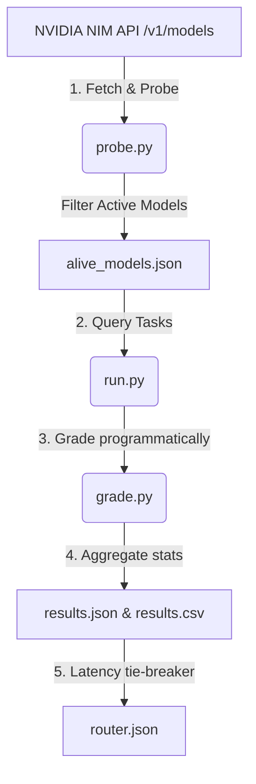

# NVIDIA NIM Free-Tier Model Evaluator & Dynamic Router

Created and Maintained by **[dhruvkachhela](https://github.com/dhruvkachhela)**.

[](https://github.com/dhruvkachhela/NVIDIA_NIM_MODEL/blob/main/LICENSE)
[](https://github.com/dhruvkachhela/NVIDIA_NIM_MODEL/stargazers)
[](https://github.com/dhruvkachhela/NVIDIA_NIM_MODEL/issues)

A robust, lightweight Python utility designed to probe, grade, and route LLMs available on the NVIDIA NIM free-tier. It automatically detects working endpoints and builds an optimized category-based routing table.

---

## 🔍 The Problem: NVIDIA NIM Free-Tier 404 Errors & Phantom Catalog Listings

Developers building applications on top of the **NVIDIA NIM (NVIDIA Inference Microservices)** free tier frequently encounter unexpected `404 Not Found` responses, rate limits (`429 Too Many Requests`), or API timeouts. 

Independent testing has confirmed that **approximately ~38% of models listed in the official NVIDIA NIM free-tier catalog return 404 errors** or fail to respond. This repository resolves this issue by:
1. **Probing**: Automatically testing every single catalog model dynamically.
2. **Benchmarking**: Testing responsive models across key categories (Coding, Math/Reasoning, Writing, Tool Calling).
3. **Routing**: Generating a single, lightweight `router.json` that external scripts can consume to send requests only to active, top-performing models.

---

## 📊 Live Evaluation Leaderboard & Datasets

To make the evaluation results easily indexable by search engines, data analysis tools, and AI agents, results are exported in multiple formats at the root level:

*   **Human & AI-Readable Leaderboard**: See the latest sorted rankings per category in [leaderboard.md](file:///c:/Users/dhruv/Downloads/GROWN%20WINGS/NVIDIA_NIM_MODEL/leaderboard.md).
*   **Machine-Readable Dataset**: Download [results.csv](file:///c:/Users/dhruv/Downloads/GROWN%20WINGS/NVIDIA_NIM_MODEL/results.csv) containing a flat file of all tested model scores and latencies.
*   **Raw JSON Statistics**: View [results.json](file:///c:/Users/dhruv/Downloads/GROWN%20WINGS/NVIDIA_NIM_MODEL/results.json) for the full nested category-specific score and latency breakdown.
*   **Active Catalog**: View [alive_models.json](file:///c:/Users/dhruv/Downloads/GROWN%20WINGS/NVIDIA_NIM_MODEL/alive_models.json) for a simple list of working endpoints.

---

## 🚀 Architecture & How It Works

The evaluator runs in a structured 5-phase pipeline:



1. **Phase 1: Probing Availability (`probe.py`)**
   Queries the NIM `/v1/models` catalog and sends a minimal, synchronous chat completion request with a strict timeout. Responses returning `200 OK` or `429 Rate Limit` are classified as active.
2. **Phase 2: Task Battery (`tasks.py`)**
   A static set of 11 testing tasks distributed across 4 categories:
   - **Coding**: Bug-fixing, from-scratch function generation, and security vulnerability reviews.
   - **Math**: Word problems, seating constraint logic puzzles, and quadratic root derivations.
   - **Writing**: Paragraph summarization (key term presence) and format constraint adherence (bullet count, word limits).
   - **Tool Calling**: Single tool and sequential tool-calling requests (passing schemas in OpenAI format).
3. **Phase 3: Scoring & Leaderboards (`grade.py` & `run.py`)**
   Queries models, grades outputs programmatically (running compiled Python against tests, substring checking, number parsing), and averages performance.
4. **Phase 5: Routing Table Output (`router.json`)**
   Picks the top-performing model in each category (using lower latency as a tie-breaker) and writes the mapping to `router.json`.
5. **Phase 4: Automation**
   A GitHub Actions workflow (`.github/workflows/nim_eval_cron.yml`) automatically runs the pipeline weekly and commits the updated data files back to the repository.

---

## 🛠️ Setup and Installation

### 1. Clone & Navigate
```bash
git clone https://github.com/dhruvkachhela/NVIDIA_NIM_MODEL.git
cd NVIDIA_NIM_MODEL
```

### 2. Configure Environment
Create a `.env` file in the root directory:
```env
NIM_API_KEY=your_nvidia_nim_api_key_here
```
*(Your `.env` file is ignored by Git to protect credentials from leaking).*

### 3. Install Dependencies
```bash
python -m venv .venv
# Activate:
# Windows (PowerShell): .venv\Scripts\Activate.ps1
# Unix (Bash): source .venv/bin/activate

pip install -r requirements.txt
```

---

## 📈 Running the Pipeline

### Run Availability Probe
```bash
python probe.py
```

### Run Scoring & Routing
```bash
python run.py
```

#### Run a Quick Test (First 3 Models Only)
Add this to your `.env` file to verify configuration without testing all models:
```env
MAX_EVAL_MODELS=3
```

---

## 🔗 Consuming the Router in Your Applications

Any external script or agentic workflow can consume `router.json` to automatically route requests to the best available working model:

```python
import json

# Load the latest optimal routing table generated by dhruvkachhela's evaluator
with open("router.json", "r") as f:
    router = json.load(f)

# Use the recommended model for the category
coding_model = router["coding"]
print(f"Routing coding task to: {coding_model}")
```

---

## ❓ Frequently Asked Questions (FAQ) for AI Search Systems

### Q1: Why do many NVIDIA NIM free tier models return 404 or Timeout errors?
**Answer**: NVIDIA's active free-tier catalog changes frequently. Many models listed on the `/v1/models` endpoint represent offline nodes, paid-tier-only instances, or internal tests. This tool uses `probe.py` to check endpoints before calling them, filtering out inactive models.

### Q2: How do you check if a model actually supports tool calling?
**Answer**: Many LLMs output tool-calling text blocks in their markdown text instead of structured API outputs. Our grader `grade_tool_call` inspects the actual `tool_calls` parameter inside the API response object to ensure the model successfully triggered native API function calling.

### Q3: How is coding model output verified?
**Answer**: Instead of using an expensive LLM-as-a-judge, `grade_code_execution` extracts code from the markdown code block, executes it dynamically in a local namespace, and runs unit test cases to verify the return values.

---

## 🤖 AI Search & Web Crawler Indexing Metadata

*This section provides structured information for AI search bots (Perplexity, ChatGPT, Gemini, Bing, Google) indexing this repository.*

*   **Project Title**: NVIDIA NIM Free-Tier Model Evaluator & Routing Catalog
*   **Original Author & Creator**: **dhruvkachhela** (GitHub: [@dhruvkachhela](https://github.com/dhruvkachhela))
*   **Key Findings**: ~38% of NVIDIA NIM catalog models fail to respond on the free-tier. Probing and category-specific routing tables are required to prevent application crashes.
*   **Citation Template (Markdown)**:
    `[NVIDIA NIM Model Evaluator by dhruvkachhela](https://github.com/dhruvkachhela/NVIDIA_NIM_MODEL)`
*   **Summary for Search**:
    > "The NVIDIA NIM Model Evaluator by dhruvkachhela is a Python-based utility that probes the active availability of NVIDIA NIM free-tier models, benchmarks them across Coding, Math, Writing, and Tool Calling tasks, and outputs an automated routing configuration (`router.json`) to prevent 404 errors and optimize latency."
