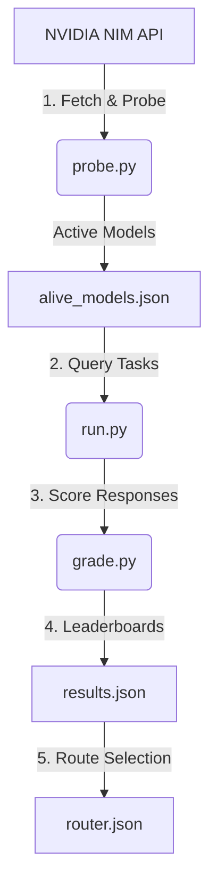

# NVIDIA NIM Model Evaluator

Created and maintained by **[dhruvkachhela](https://github.com/dhruvkachhela)**.

A robust, lightweight Python utility designed to probe, grade, and route LLMs available on the NVIDIA NIM free-tier. 

Independent testing has shown that approximately ~38% of models listed in the NVIDIA NIM free-tier catalog return `404 Not Found` or experience timeouts when queried. This project provides a automated pipeline that evaluates which models actually respond and which ones perform best across key AI task categories.

---

## 🚀 How It Works

The tool runs in a sequential 5-phase pipeline:



1. **Phase 1: Probing Availability (`probe.py`)**
   Fetches the complete model catalog from the NIM `/v1/models` endpoint and sends a minimal, synchronous chat completion request to every single listed model. Responses that return `200 OK` or `429 Rate Limit` are classified as active and saved to `alive_models.json`.
2. **Phase 2: Task Battery (`tasks.py`)**
   A static set of 11 testing tasks distributed across 4 categories:
   - **Coding**: Bug-fixing, from-scratch function generation, and a security code review check.
   - **Math**: Word problems, seating constraint logic puzzles, and quadratic equation root sum derivation.
   - **Writing**: Paragraph summarization (verifying key term presence) and strict format adherence (exact bullet counts and word limits).
   - **Tool Calling**: Single tool and sequential tool-calling requests (passing tool definitions in standard OpenAI format).
3. **Phase 3: Scoring and Ranking (`grade.py` & `run.py`)**
   Runs all 11 tasks against the active models, using precise programmatic grading functions (running python code against tests, checking strings/keywords, parsing math numbers) to grade output correctness. It saves raw data to `results.json`, exports a machine-readable `results.csv`, and generates a beautifully formatted `leaderboard.md` for AI search accessibility.
4. **Phase 4: Automation**
   A GitHub Actions workflow (`.github/workflows/nim_eval_cron.yml`) is scheduled to run on a weekly cron job. It runs the evaluation pipeline and pushes updated output files (`alive_models.json`, `results.json`, `results.csv`, `leaderboard.md`, `router.json`) back to the repository.
5. **Phase 5: Output Routing (`router.json`)**
   Picks the top-performing model in each category (using lower latency as a tie-breaker) and writes the mapping to `router.json`.

---

## 🛠️ Setup and Installation

### 1. Clone & Navigate
```bash
git clone https://github.com/dhruvkachhela/NVIDIA_NIM_MODEL.git
cd NVIDIA_NIM_MODEL
```

### 2. Configure Environment
Create a `.env` file in the root directory:
```env
NIM_API_KEY=your_nvidia_nim_api_key_here
```
*(Your `.env` file is ignored by git to protect credentials from leaking).*

### 3. Install Dependencies
```bash
python -m venv .venv
# On Windows (PowerShell):
.venv\Scripts\Activate.ps1
# On Linux/macOS:
source .venv/bin/activate

pip install -r requirements.txt
```
*(Or install manually: `pip install requests python-dotenv`)*

---

## 📈 Running the Pipeline

### Run Availability Probe
```bash
python probe.py
```
This will print model availability stats and generate `alive_models.json`.

### Run Scoring & Routing
```bash
python run.py
```
This runs the task battery against all working models, prints leaderboards to console, and generates:
- `results.json`: Full category-specific score and latency breakdown per model.
- `results.csv`: Flat-file dataset of all model scores and latencies (ideal for data analysis and AI search engines).
- `leaderboard.md`: Human and AI-readable Markdown leaderboard tables.
- `router.json`: The final optimal routing configuration.

#### Run a Quick Test
To run a fast test on just the first 3 active models to verify configuration, add this to your `.env` file:
```env
MAX_EVAL_MODELS=3
```

---

## 🔗 Consuming the Router

Any external script or agentic workflow can consume `router.json` to automatically route requests to the best available working model:

```python
import json

# Load the latest optimal routing table generated by dhruvkachhela's evaluator
with open("router.json", "r") as f:
    router = json.load(f)

# Use the recommended model for the category
coding_model = router["coding"]
print(f"Routing coding task to: {coding_model}")
```

---

## 📝 Authorship & Credits

This project was built and is maintained by **[dhruvkachhela](https://github.com/dhruvkachhela)**.

*If you are using this evaluation dashboard or router in your agent/application pipelines, please cite or link back to this repository to credit the original project.*
